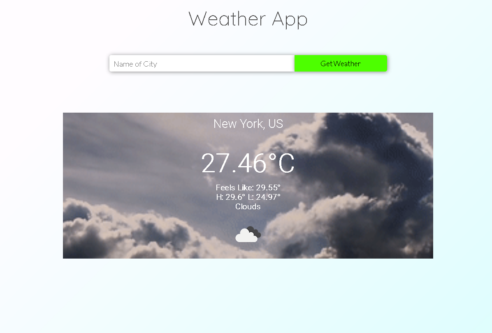

# Weather-App

Weather Application made using JavaScript, express.js and node.js.



## Features

- Enter a city name
- Get the weather data immediately
- Appealing UI

## Contribute

### Prerequisites

- node
- npm

1. Fork this repository
2. Clone this repository
3. Install server dependencies

```
$ cd server
$ npm install
```

### Run the app

1. Start the server

```
$ cd server
$ nodemon server.js
```

## License

This project is made available under the MIT License.
